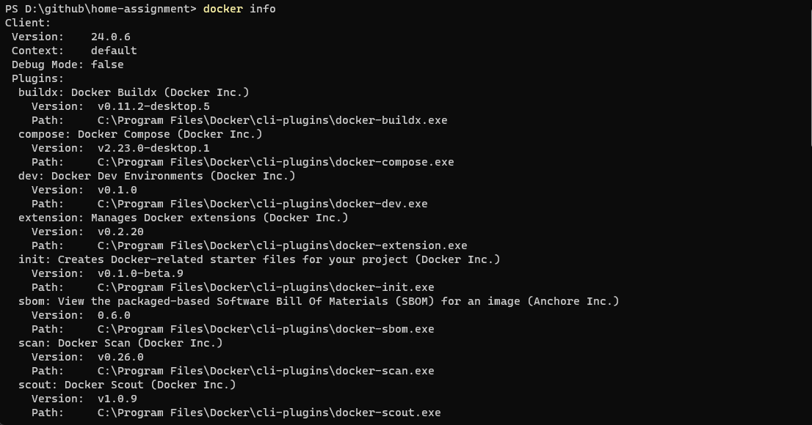

Github repo link: https://github.com/baotruonganh1230/home-assignment

This is my implement for the Simple RESTful API Take Home Assignment.

There are 2 ways to run these APIs:

1. Use Docker:
- Install Docker: https://www.docker.com/products/docker-desktop/
- Once installed, open the command line and verify it with command: ```docker info``` before going to the next step

  


- Clone this github repository or download and extract the google drive zip to your local machine
- Open the command line inside the folder you've just clone the repo
- Execute this command: ```docker-compose up``` and wait until the server is ready.

  


- Now the APIs will be available on your locahost on port 8091. 
- But before you can access those APIs, you must send the login request to ```http://localhost:8091/auth/login``` first. The request must have a json body with ```username``` and ```password``` element both set as ```admin```.
  
  


- The API will return a Bearer token, set the value of ```Authorization``` header to ```Bearer + <token>``` before sending any request to other APIs.

  


- List of other available APIs are:
   + ```GET http://localhost:8091/tasks```
   + ```GET http://localhost:8091/tasks/{id}```
   + ```POST http://localhost:8091/tasks```
   + ```PUT http://localhost:8091/tasks/{id}```
   + ```DELETE http://localhost:8091/tasks/{id}```
2. Call the endpoints directly:
- I've also deployed these APIs onto AWS Elastic Beanstalk. Same like above, you must call authentication endpoint to get the Bearer token before you can request other endpoints.
- The authetication endpoint is: ```http://home-assignment-eb.ap-southeast-1.elasticbeanstalk.com/auth/login```
- List of other available endpoints are:
   + ```GET http://home-assignment-eb.ap-southeast-1.elasticbeanstalk.com/tasks```
   + ```GET http://home-assignment-eb.ap-southeast-1.elasticbeanstalk.com/tasks/{id}```
   + ```POST http://home-assignment-eb.ap-southeast-1.elasticbeanstalk.com/tasks```
   + ```PUT http://home-assignment-eb.ap-southeast-1.elasticbeanstalk.com/tasks/{id}```
   + ```DELETE http://home-assignment-eb.ap-southeast-1.elasticbeanstalk.com/tasks/{id}```

I also implemented some error handling. But given the short time, it might not cover all the cases.